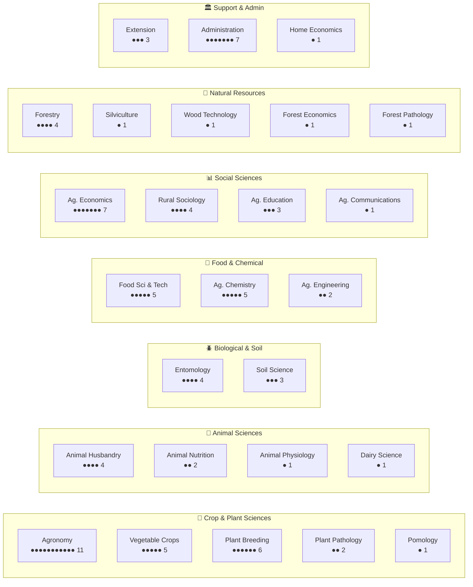
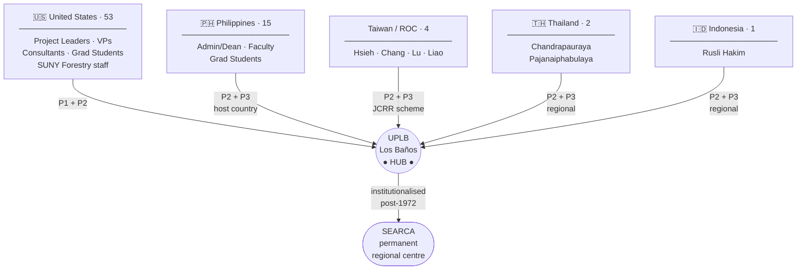

# Cornell University International Agriculture Records

### Box 12 · Volume 24 · Call No. 21-2-1700 · c. 1957–1972

> **Retrieved by:** Kuan-Chi Wang\
> **Physical item:** 3,254-page digitised PDF (1.54 GB)\
> **Holding institution:** Cornell University Library Annex\
> **Research conducted:** May 2026

------------------------------------------------------------------------

## Table of Contents

1.  [Archive Overview](#1-archive-overview)
2.  [Project 1 — Forestry Assistance Program (1957–1966)](#2-project-1--forestry-assistance-program-19571966)
3.  [Project 2 — UP-Cornell Graduate Education Program / UPCO (1963–1972)](#3-project-2--up-cornell-graduate-education-program--upco-19631972)
4.  [Project 3 — SEARCA Regional Program (1967–1972)](#4-project-3--searca-regional-program-19671972)
5.  [Full Personnel Register — All 82 Persons](#5-full-personnel-register--all-82-persons)
6.  [Affiliation Networks](#6-affiliation-networks)
    -   [6a. Network by Project](#6a-network-by-project)
    -   [6b. Network by Discipline](#6b-network-by-discipline)
    -   [6c. Network by Country](#6c-network-by-country)
7.  [Thematic Topics Across the Archive](#7-thematic-topics-across-the-archive)
8.  [Key Institutions](#8-key-institutions)
9.  [Outputs Produced](#9-outputs-produced)

------------------------------------------------------------------------

## 1. Archive Overview

Box 12 / Volume 24 of the Cornell University International Agriculture Records is a bound collection of final reports, annual reviews, consultant trip reports, graduate student papers, planning documents, budget statements, appendices, and correspondence relating to a series of USAID- and Ford Foundation-funded agricultural development programmes at the University of the Philippines. The documents span fifteen years and three distinct but operationally overlapping projects, all centred on building institutional capacity at Philippine and regional agricultural colleges through graduate education, visiting faculty, research support, and physical infrastructure development.

The three projects in sequence were:

| \# | Name | Dates | Contractor | Funder | Partner |
|----|----|----|----|----|----|
| P1 | Forestry Assistance Program | 1957–1966 | Cornell → SUNY Syracuse | USAID/ICA | UPCF, Laguna |
| P2 | UP-Cornell Graduate Education Program (UPCO) | 1963–1972 | Cornell University | Ford Foundation | UPCA, Los Baños |
| P3 | SEARCA Regional Program | 1967–1972 | Cornell University | Ford Foundation | UPLB / SEARCA |

Together the three projects involved **82 named participants** from **6 countries**, across **26 academic disciplines**, working in a network anchored at the University of the Philippines at Los Baños (UPLB).

------------------------------------------------------------------------

## 2. Project 1 — Forestry Assistance Program (1957–1966)

### Background

The University of the Philippines College of Forestry (UPCF), located in College, Laguna, had been under the direct control of the Philippine Bureau of Forestry since its founding in 1910. The College was formally separated from the Bureau in 1957, the same year the assistance programme began. Its buildings had been damaged in the Second World War, its library destroyed, and its faculty almost entirely without postgraduate qualifications. The programme was conceived as a comprehensive institutional rebuilding effort.

Cornell University held the initial contract from April 1957 to June 1960, under which it was already managing a parallel programme for the College of Agriculture. When the Cornell–Agriculture contract expanded in scope (see P2), responsibility for the Forestry programme transferred to the State University College of Forestry at Syracuse (SUNY), which ran it until June 1966. Although there were two contractors, they maintained consistent objectives, methods, and standards throughout.

### Objectives

The programme operated against eight formal objectives:

1.  Modernise the curriculum of the College of Forestry
2.  Train faculty members through overseas postgraduate education
3.  Improve teaching methods
4.  Improve student recruitment and increase the number of professional graduates
5.  Develop effective programmes of graduate instruction, research, and public information
6.  Enlarge the physical plant and acquire instructional and laboratory equipment
7.  Improve College-wide organisation and administration
8.  Strengthen and expand cooperative relationships within and outside the University

### Key Outcomes

By the programme's close in June 1966, UPCF had 49 faculty members. Of these, 32 had been sent abroad for additional education and training, 29 of them under the SUNY contract. Advanced degrees had been awarded to 22 current faculty, with one Ph.D.; a further faculty member held a Master's from UP Diliman — meaning 45 per cent of the faculty held advanced degrees at close. A further 10 faculty members were abroad on advanced studies at the time of the final report, with 7 more scheduled to go in the following autumn.

New physical facilities constructed under the programme included a sawmill, garage and maintenance shop, expanded forest products teaching laboratory, and faculty housing. A new campus plan was drawn up (Appendix B of the P1 Final Report). Special legislation was passed to place Makiling Park under the College's control, providing a major new research and teaching forest. Total financial support: approximately **US \$545,848** in dollar contract funds, plus **₱11,079,859** (\~US \$277,000) in Philippine counterpart and special budget funds.

### Project 1 Personnel

| Name | Role | Discipline |
|----|----|----|
| Hardy L. Shirley | SUNY Project Leader / Dean | Forestry |
| James E. Davis | SUNY Visiting Professor | Forestry |
| William L. Webb | SUNY Visiting Professor | Forestry |
| C.E. Farnsworth | SUNY Visiting Professor | Silviculture |
| Halsey B. Knapp | SUNY Visiting Professor / Project Leader | Forestry |
| Carl H. de Zeeuw | SUNY Visiting Professor | Wood Technology |
| Charles C. Larson | SUNY Visiting Professor | Forest Economics |
| Savel B. Silverborg | SUNY Visiting Professor | Forest Pathology |

------------------------------------------------------------------------

## 3. Project 2 — UP-Cornell Graduate Education Program / UPCO (1963–1972)

### Background

The UP-Cornell Graduate Education Program, known administratively as UPCO, was the largest and most sustained collaboration in the archive. It ran for nine years under primary Ford Foundation funding, with additional support from USAID, the Rockefeller Foundation, and a World Bank infrastructure loan. Cornell's New York State College of Agriculture partnered with the University of the Philippines College of Agriculture (UPCA) at Los Baños, Laguna. Seven successive Cornell project leaders managed the programme from September 1963 to June 1972.

The programme's core ambition was to transform UPCA from a teaching college into a doctorally-capable regional research university — one that could train not only Filipino agricultural scientists but serve as a graduate centre for all of Southeast Asia. At the programme's terminal year (1971–72), UPCA had students enrolled from 17 Asian countries and was being wound down into the permanent SEARCA institution (see P3).

### Project Leaders

| Name                 | Discipline       | Period              |
|----------------------|------------------|---------------------|
| Nyle C. Brady        | Agronomy         | Sep 1963 – Nov 1963 |
| Richard Bradfield    | Agronomy         | Jan 1964 – Jul 1964 |
| Herbert L. Everett   | Agronomy         | Jul 1964 – Jan 1966 |
| George W. Trimberger | Animal Husbandry | Jan 1966 – Nov 1967 |
| Joseph F. Metz Jr.   | Agronomy         | Sep 1967 – Jul 1969 |
| Kenneth L. Turk      | Administration   | (acting / overlap)  |
| Morrill T. Vittum    | Vegetable Crops  | Jun 1969 – Jun 1972 |

### Programme Structure

**Graduate training.** Philippine UPCA faculty members were awarded fellowships to pursue M.S. and Ph.D. programmes at Cornell and other American universities. Funding came from UPCO, USAID/AID, the Rockefeller Foundation, and individual assistantships. The goal was a self-sustaining cadre of doctorally-qualified staff at Los Baños.

**Visiting professors.** 25+ Cornell faculty members were posted to Los Baños for terms of one to two years, teaching graduate courses, advising theses, assisting with curriculum reform, and contributing to departmental research. Disciplines spanned the full range of agricultural science, social science, and engineering.

**Short-term consultants.** Over 20 Cornell specialists made focused visits (typically 4–16 weeks) to address specific departmental needs — plant protection, home economics, food technology, business administration, library science, animal science, and others.

**Asian participation.** From the mid-1960s the programme included Asian visiting professors and graduate students from Taiwan/ROC (via the Sino-American Joint Commission on Rural Reconstruction), Thailand, and Indonesia. This dimension prefigured and directly contributed to the founding of SEARCA (P3).

**Infrastructure.** A World Bank loan supported a major campus building programme — new discipline laboratories, classroom blocks, and faculty housing. UPCO funds supported the establishment of the Los Baños Computing Center (LBCC), a Food Science pilot plant, the Dairy Training and Research Institute (DTRI), a Central Scientific Supply House (CSSH), major expansion of the UPCA library collection, and a Textbook Board to produce Philippines-based agricultural teaching materials.

**ACAP support.** UPCO funds also supported the Association of Colleges of Agriculture in the Philippines (ACAP), with 55 research projects and 13 member-institution staff completing M.S. studies at UPLB during the programme's life.

### Visiting Professors (P2)

| Name | Discipline | Arrived | Departed |
|----|----|----|----|
| Maurice C. Bond | Extension | Sep 1963 | Aug 1964 |
| Gilbert Levine | Agricultural Engineering | Sep 1963 | Aug 1968 |
| Arthur E. Durfee | Extension | May 1965 | May 1969 |
| Robert B. Musgrave | Agronomy | Jul 1964 | Jan 1966 |
| Barbour L. Herrington | Agricultural Chemistry | Jul 1964 | Jun 1967 |
| James E. Knott | Agronomy / Vegetable Crops | Aug 1964 | Jul 1967 |
| Carl S. Pederson | Food Science & Technology | Jul 1965 | Jul 1967 |
| Randolph X. Barker | Agricultural Economics | Jul 1967 | Jul 1967 |
| Harry R. Ainslie | Extension | Jan 1966 | Jul 1967 |
| Robert M. Smock | Pomology | Jun 1966 | Jun 1967 |
| Lowell D. Uhler | Entomology | Jul 1966 | Dec 1967 |
| Edward H. Glass | Entomology | Jul 1966 | Dec 1967 |
| James C. Sentz | Plant Breeding | Jul 1966 | May 1968 |
| Donald H. Wallace | Vegetable Crops | Jul 1967 | Mar 1969 |
| Frederick K.T. Tom | Agricultural Education | Jul 1967 | Nov 1968 |
| Keith H. Steinkraus | Food Science & Technology | Jul 1967 | Jun 1969 |
| James C. Miller | Animal Husbandry | Jul 1967 | Aug 1969 |
| D. Ralph Strength | Agricultural Chemistry | Jul 1967 | Jul 1969 |
| Reeshon Feuer | Agronomy | Dec 1967 | Jun 1968 |
| Roger G. Young | Agricultural Chemistry | Jul 1968 | Jun 1969 |
| David R. Bouldin | Soil Science | Jul 1968 | Jun 1969 |
| Harold R. Cushman | Agricultural Education | Aug 1968 | Mar 1969 |
| Malcolm C. Bourne | Food Science & Technology | Feb 1969 | — (also P3) |
| Henry M. Munger | Vegetable Crops | Jun 1969 | — |
| Otto E. Schultz | Plant Pathology | Jun 1969 | — (also P3) |
| John N. Hathcock | Agricultural Chemistry | — | — (also P3) |
| Lawrence B. Darrah | Agricultural Economics | Jul 1968 | Dec 1968 (also P3) |

### Consultants (P2)

| Name               | Discipline                        |
|--------------------|-----------------------------------|
| David B. Hand      | Food Science & Technology         |
| Robert A. Polson   | Rural Sociology                   |
| Loy V. Crowder     | Agronomy                          |
| Milton L. Scott    | Animal Nutrition                  |
| David Pimentel     | Entomology                        |
| Robert L. Plaisted | Plant Breeding                    |
| H. David Thurston  | Plant Pathology                   |
| J.K. Loosli        | Animal Husbandry                  |
| William B. Ward    | Agricultural Communications       |
| Charles E. Palm    | Administration (Admin Consultant) |
| W. Keith Kennedy   | Administration (Admin Consultant) |

### Cornell Graduate Students (P2)

| Name               | Discipline             |
|--------------------|------------------------|
| Charles A. Francis | Plant Breeding         |
| Pedro A. Sanchez   | Soil Science           |
| Albert J. Nyberg   | Agricultural Economics |
| Isao Fujimoto      | Rural Sociology        |
| Bruce Koppel       | Rural Sociology        |
| H. Christian Wien  | Vegetable Crops        |
| Gerald C. Wheelock | Rural Sociology        |
| Joseph R. Novak    | Agronomy               |

### Philippine Administration and Faculty (P2)

| Name              | Role                    | Discipline      |
|-------------------|-------------------------|-----------------|
| Salvador P. Lopez | Philippine Admin        | Administration  |
| D.L. Umali        | Philippine Admin / Dean | Administration  |
| F.A. Bernardo     | Philippine Admin        | Administration  |
| F.T. Orillo       | Philippine Admin / Dean | Administration  |
| R.L. Villareal    | Philippine Faculty      | Vegetable Crops |
| G.T. Castillo     | Philippine Faculty      | Rural Sociology |

### Philippine Graduate Students (P2)

| Name                | Discipline               |
|---------------------|--------------------------|
| Emil G. Javier      | Plant Breeding           |
| Noel G. Mamicpic    | Agronomy                 |
| Mario M. Labadan    | Animal Nutrition         |
| Jesus V. Melgar     | Dairy Science            |
| Igmidio T. Corpuz   | Soil Science             |
| Senen M. Miranda    | Agricultural Engineering |
| Vicente G. Momongan | Animal Physiology        |
| Leo C. Rimando      | Entomology               |
| Pons Batugal        | Agronomy                 |

------------------------------------------------------------------------

## 4. Project 3 — SEARCA Regional Program (1967–1972)

### Background

SEARCA — the Southeast Asian Regional Center for Graduate Study and Research in Agriculture — was established on the Los Baños campus as a direct institutional outgrowth of P2. Where P2 focused on building UPCA's own graduate capacity, P3 formalised UPCA's role as a regional hub for all of Southeast Asia: enrolling graduate students and hosting visiting academics from multiple countries, and building regional research networks.

Cornell's involvement continued through several visiting professors whose assignments bridged P2 and P3 — Malcolm Bourne (Food Science), Otto Schultz (Plant Pathology), John Hathcock (Agricultural Chemistry), and Lawrence Darrah (Agricultural Economics) — and through a cohort of Asian participants brought in via the Sino-American Joint Commission on Rural Reconstruction and related bilateral arrangements.

The P3 period (1967–1972) overlaps substantially with the closing years of P2, and the two programmes are treated as distinct in the archive's formal appendices but were operationally intertwined on the ground. SEARCA continued as a permanent independent regional institution after the Cornell contract terminated in June 1972.

### Asian Participants (P3 / P2–P3 overlap)

| Name | Role | Discipline | Country |
|----|----|----|----|
| S.C. Hsieh | Asian Visiting Professor | Agricultural Economics | Taiwan |
| C.W. Chang | Asian Visiting Professor | Agricultural Education | Taiwan |
| C. Chandrapauraya | Asian Participant | Food Science & Technology | Thailand |
| Rusli Hakim | Grad Student (Asia) | Plant Breeding | Indonesia |
| Y.Y. Lu | Grad Student (Asia) | Agricultural Economics | Taiwan |
| S.H. Liao | Grad Student (Asia) | Agricultural Economics | Taiwan |
| M. Pajanaiphabulaya | Grad Student (Asia) | Home Economics | Thailand |

------------------------------------------------------------------------

## 5. Full Personnel Register — All 82 Persons

> Colour key for role: **PL** = Project Leader · **VP** = Visiting Professor · **CO** = Consultant · **AC** = Admin Consultant · **GC** = Grad Student (Cornell) · **SF** = SUNY Forestry · **PA** = Philippine Admin/Faculty · **GP** = Grad Student (Philippines) · **AS** = Asian Participant/Student

| Name | Role | Discipline | Country | Project(s) |
|----|----|----|----|----|
| Nyle C. Brady | PL | Agronomy | USA | P2 |
| Kenneth L. Turk | PL | Administration | USA | P2 |
| Richard Bradfield | PL | Agronomy | USA | P2 |
| Herbert L. Everett | PL | Agronomy | USA | P2 |
| George W. Trimberger | PL | Animal Husbandry | USA | P2 |
| Joseph F. Metz Jr. | PL | Agronomy | USA | P2 |
| Morrill T. Vittum | PL | Vegetable Crops | USA | P2 |
| Maurice C. Bond | VP | Extension | USA | P2 |
| Gilbert Levine | VP | Agricultural Engineering | USA | P2 |
| Arthur E. Durfee | VP | Extension | USA | P2 |
| Robert B. Musgrave | VP | Agronomy | USA | P2 |
| Barbour L. Herrington | VP | Agricultural Chemistry | USA | P2 |
| James E. Knott | VP | Agronomy | USA | P2 |
| Carl S. Pederson | VP | Food Science & Technology | USA | P2 |
| Randolph X. Barker | VP | Agricultural Economics | USA | P2 |
| Harry R. Ainslie | VP | Extension | USA | P2 |
| Robert M. Smock | VP | Pomology | USA | P2 |
| Lowell D. Uhler | VP | Entomology | USA | P2 |
| Edward H. Glass | VP | Entomology | USA | P2 |
| James C. Sentz | VP | Plant Breeding | USA | P2 |
| Donald H. Wallace | VP | Vegetable Crops | USA | P2 |
| Frederick K.T. Tom | VP | Agricultural Education | USA | P2 |
| Keith H. Steinkraus | VP | Food Science & Technology | USA | P2 |
| James C. Miller | VP | Animal Husbandry | USA | P2 |
| D. Ralph Strength | VP | Agricultural Chemistry | USA | P2 |
| Reeshon Feuer | VP | Agronomy | USA | P2 |
| Roger G. Young | VP | Agricultural Chemistry | USA | P2 |
| David R. Bouldin | VP | Soil Science | USA | P2 |
| Harold R. Cushman | VP | Agricultural Education | USA | P2 |
| Malcolm C. Bourne | VP | Food Science & Technology | USA | P2, P3 |
| Henry M. Munger | VP | Vegetable Crops | USA | P2 |
| Otto E. Schultz | VP | Plant Pathology | USA | P2, P3 |
| John N. Hathcock | VP | Agricultural Chemistry | USA | P2, P3 |
| Lawrence B. Darrah | VP | Agricultural Economics | USA | P2, P3 |
| David B. Hand | CO | Food Science & Technology | USA | P2 |
| Robert A. Polson | CO | Rural Sociology | USA | P2 |
| Loy V. Crowder | CO | Agronomy | USA | P2 |
| Milton L. Scott | CO | Animal Nutrition | USA | P2 |
| David Pimentel | CO | Entomology | USA | P2 |
| Robert L. Plaisted | CO | Plant Breeding | USA | P2 |
| H. David Thurston | CO | Plant Pathology | USA | P2 |
| J.K. Loosli | CO | Animal Husbandry | USA | P2 |
| William B. Ward | CO | Agricultural Communications | USA | P2 |
| Charles E. Palm | AC | Administration | USA | P2 |
| W. Keith Kennedy | AC | Administration | USA | P2 |
| Charles A. Francis | GC | Plant Breeding | USA | P2 |
| Pedro A. Sanchez | GC | Soil Science | USA | P2 |
| Albert J. Nyberg | GC | Agricultural Economics | USA | P2 |
| Isao Fujimoto | GC | Rural Sociology | USA | P2 |
| Bruce Koppel | GC | Rural Sociology | USA | P2 |
| H. Christian Wien | GC | Vegetable Crops | USA | P2 |
| Gerald C. Wheelock | GC | Rural Sociology | USA | P2 |
| Joseph R. Novak | GC | Agronomy | USA | P2 |
| Hardy L. Shirley | SF | Forestry | USA | P1 |
| James E. Davis | SF | Forestry | USA | P1 |
| William L. Webb | SF | Forestry | USA | P1 |
| C.E. Farnsworth | SF | Silviculture | USA | P1 |
| Halsey B. Knapp | SF | Forestry | USA | P1 |
| Carl H. de Zeeuw | SF | Wood Technology | USA | P1 |
| Charles C. Larson | SF | Forest Economics | USA | P1 |
| Savel B. Silverborg | SF | Forest Pathology | USA | P1 |
| Salvador P. Lopez | PA | Administration | Philippines | P2 |
| D.L. Umali | PA | Administration | Philippines | P2, P3 |
| F.A. Bernardo | PA | Administration | Philippines | P2, P3 |
| F.T. Orillo | PA | Administration | Philippines | P2 |
| R.L. Villareal | PA | Vegetable Crops | Philippines | P2 |
| G.T. Castillo | PA | Rural Sociology | Philippines | P2 |
| Emil G. Javier | GP | Plant Breeding | Philippines | P2 |
| Noel G. Mamicpic | GP | Agronomy | Philippines | P2 |
| Mario M. Labadan | GP | Animal Nutrition | Philippines | P2 |
| Jesus V. Melgar | GP | Dairy Science | Philippines | P2 |
| Igmidio T. Corpuz | GP | Soil Science | Philippines | P2 |
| Senen M. Miranda | GP | Agricultural Engineering | Philippines | P2 |
| Vicente G. Momongan | GP | Animal Physiology | Philippines | P2 |
| Leo C. Rimando | GP | Entomology | Philippines | P2 |
| Pons Batugal | GP | Agronomy | Philippines | P2 |
| S.C. Hsieh | AS | Agricultural Economics | Taiwan | P2, P3 |
| C.W. Chang | AS | Agricultural Education | Taiwan | P2, P3 |
| C. Chandrapauraya | AS | Food Science & Technology | Thailand | P2, P3 |
| Rusli Hakim | AS | Plant Breeding | Indonesia | P2, P3 |
| Y.Y. Lu | AS | Agricultural Economics | Taiwan | P2, P3 |
| S.H. Liao | AS | Agricultural Economics | Taiwan | P2, P3 |
| M. Pajanaiphabulaya | AS | Home Economics | Thailand | P2, P3 |

------------------------------------------------------------------------

## 6. Affiliation Networks

Three bipartite affiliation networks were constructed from the personnel register. Each links the 82 persons to hub categories (projects, disciplines, or countries). The fully interactive D3.js version with zoom, search, and click-to-highlight is at `Cornell_Affiliation_Networks.html`. The Mermaid diagrams below render in GitHub, Obsidian, VS Code, and most modern markdown viewers.

------------------------------------------------------------------------

### 6a. Network by Project

Each person is linked to the project(s) they participated in. 13 persons bridge P2 and P3; P1 and P2 share no personnel.

``` mermaid
graph LR
    P1(["P1
Forestry
1957–66"]):::proj
    P2(["P2
UPCO
1963–72"]):::proj
    P3(["P3
SEARCA
1967–72"]):::proj

    shirley["Hardy Shirley"] & davis["James Davis"] & webb["William Webb"] --> P1
    farnsworth["C.E. Farnsworth"] & knapp["Halsey Knapp"] --> P1
    dezeeuw["Carl de Zeeuw"] & larson["Charles Larson"] & silverborg["Savel Silverborg"] --> P1

    brady["Nyle Brady"] & bradfield["R. Bradfield"] & everett["H. Everett"] --> P2
    trimberger["G. Trimberger"] & metz["J. Metz"] & vittum["M. Vittum"] & turk["K. Turk"] --> P2
    musgrave["R. Musgrave"] & smock["R. Smock"] & barker["R. Barker"] --> P2
    uhler["L. Uhler"] & glass["E. Glass"] & sentz["J. Sentz"] & wallace["D. Wallace"] --> P2
    pederson["C. Pederson"] & steinkraus["K. Steinkraus"] & miller_jc["J. Miller"] --> P2
    bond["M. Bond"] & durfee["A. Durfee"] & ainslie["H. Ainslie"] --> P2
    herrington["B. Herrington"] & strength["D. Strength"] & young["R. Young"] --> P2
    levine["G. Levine"] & bouldin["D. Bouldin"] & cushman["H. Cushman"] --> P2
    feuer["R. Feuer"] & tom["F. Tom"] & munger["H. Munger"] --> P2
    hand["D. Hand"] & polson["R. Polson"] & crowder["L. Crowder"] --> P2
    scott["M. Scott"] & pimentel["D. Pimentel"] & plaisted["R. Plaisted"] --> P2
    thurston["H. Thurston"] & loosli["J. Loosli"] & ward["W. Ward"] --> P2
    palm["C. Palm"] & kennedy["W. Kennedy"] --> P2
    francis["C. Francis"] & sanchez["P. Sanchez"] & nyberg["A. Nyberg"] --> P2
    fujimoto["I. Fujimoto"] & koppel["B. Koppel"] & wien["H. Wien"] --> P2
    wheelock["G. Wheelock"] & novak["J. Novak"] --> P2
    lopez["S. Lopez"] & orillo["F. Orillo"] --> P2
    villareal["R. Villareal"] & castillo["G. Castillo"] --> P2
    javier["E. Javier"] & mamicpic["N. Mamicpic"] & labadan["M. Labadan"] --> P2
    melgar["J. Melgar"] & corpuz["I. Corpuz"] & miranda["S. Miranda"] --> P2
    momongan["V. Momongan"] & rimando["L. Rimando"] & batugal["P. Batugal"] --> P2

    bourne["M. Bourne"] --> P2 & P3
    schultz["O. Schultz"] --> P2 & P3
    hathcock["J. Hathcock"] --> P2 & P3
    darrah["L. Darrah"] --> P2 & P3
    umali["D. Umali"] --> P2 & P3
    bernardo["F. Bernardo"] --> P2 & P3
    hsieh["S.C. Hsieh"] --> P2 & P3
    chang_cw["C.W. Chang"] --> P2 & P3
    chandra["C. Chandrapauraya"] --> P2 & P3
    hakim["R. Hakim"] --> P2 & P3
    lu["Y.Y. Lu"] --> P2 & P3
    liao["S.H. Liao"] --> P2 & P3
    pajana["M. Pajana..."] --> P2 & P3

    classDef proj fill:#2a3060,stroke:#5060c0,color:#c0ccff,font-weight:bold
```




**Project membership:**

| Project          | Persons |     Share |
|------------------|---------|----------:|
| P1 only          | 8       |      10 % |
| P2 only          | 56      |      68 % |
| P3 only          | 0       |       0 % |
| P2 + P3          | 13      |      16 % |
| **Total unique** | **82**  | **100 %** |

------------------------------------------------------------------------

### 6b. Network by Discipline

Each person is linked to their primary academic discipline (26 nodes, 7 domain clusters).




**All 26 disciplines ranked by person count:**

```         
Agronomy              ███████████  11
Ag. Economics         ███████       7
Administration        ███████       7
Plant Breeding        ██████        6
Food Sci & Tech       █████         5
Ag. Chemistry         █████         5
Vegetable Crops       █████         5
Entomology            ████          4
Animal Husbandry      ████          4
Rural Sociology       ████          4
Forestry              ████          4
Soil Science          ███           3
Extension             ███           3
Ag. Education         ███           3
Animal Nutrition      ██            2
Plant Pathology       ██            2
Ag. Engineering       ██            2
Pomology              █             1
Animal Physiology     █             1
Dairy Science         █             1
Silviculture          █             1
Wood Technology       █             1
Forest Economics      █             1
Forest Pathology      █             1
Home Economics        █             1
Ag. Communications    █             1
```

------------------------------------------------------------------------

### 6c. Network by Country

Each person is linked to their home country. P1 is entirely US-staffed; P2/P3 introduce Philippine and Asian nodes.




**Country × Project matrix:**

| Country     |  P1   |   P2   |   P3   | Unique persons |
|-------------|:-----:|:------:|:------:|---------------:|
| USA         |   8   |   52   |   4    |         **53** |
| Philippines |   —   |   15   |   2    |         **15** |
| Taiwan      |   —   |   4    |   4    |          **4** |
| Thailand    |   —   |   2    |   2    |          **2** |
| Indonesia   |   —   |   1    |   1    |          **1** |
| **Total**   | **8** | **74** | **13** |         **82** |

*Column totals exceed 82 because 13 persons appear in both P2 and P3.*

------------------------------------------------------------------------

## 7. Thematic Topics Across the Archive

The archive's 3,254 pages organise around eight recurring thematic clusters:

### 1. Graduate Education and Training

Degree programmes, thesis supervision, graduate assistantships, fellowship arrangements, and the annual cycle of students entering, completing, and returning to their home institutions. The archive contains dozens of individual thesis summaries, supervisor reports, and completion records.

### 2. Curriculum Development

Course modernisation proposals, syllabi, laboratory design, teaching method reform, and the translation of US agricultural science curricula to Philippine tropical conditions. Several visiting professors' reports are essentially detailed subject-by-subject curriculum reviews.

### 3. Faculty Development

Overseas training plans, staff recruitment, salary structures, promotion criteria, and the political difficulties of retaining trained staff against competing government and private-sector salaries. The P1 final report contains extended analysis of the gap between academic salaries and what trained foresters could earn in industry.

### 4. Physical Facilities

Campus building programmes, laboratory design and layout approvals, World Bank reporting, equipment procurement, and the chronic delays caused by government counterpart fund release procedures. The P2 annual reports contain detailed running accounts of individual building projects.

### 5. Research Programs

Crop science (rice, corn, sugarcane, vegetables, fruit, fibre crops), animal science, food technology, soil science, agricultural economics, and rural sociology research projects. Many visiting professor reports include summaries of jointly supervised research.

### 6. Extension and Outreach

Farmer contact, vocational agriculture education, in-service training for extension workers, and the ACAP network for distributing knowledge to member colleges across the Philippines.

### 7. Institutional Administration

Programme management, UPCO office operations, counterpart fund administration, World Bank and Ford Foundation reporting, and the mechanics of coordinating a multi-country programme with multiple funding streams.

### 8. Regional Cooperation

Asian participation (Taiwan/ROC, Thailand, Indonesia), the founding and initial operations of SEARCA, regional conferences, the ACAP network, and cooperation with co-located institutions such as IRRI (International Rice Research Institute) at Los Baños.

------------------------------------------------------------------------

## 8. Key Institutions

| Institution | Country | Role |
|----|----|----|
| Cornell University (NYSCA) | USA | Primary contractor P2; initial contractor P1 |
| SUNY College of Forestry at Syracuse | USA | Contractor P1 (1960–1966) |
| University of the Philippines College of Agriculture (UPCA) | Philippines | Partner P2, P3 |
| University of the Philippines College of Forestry (UPCF) | Philippines | Partner P1 |
| Ford Foundation | USA/International | Primary funder P2 |
| USAID / AID / ICA | USA | Primary funder P1; co-funder P2 |
| World Bank | International | Infrastructure loan for UPLB campus buildings |
| Rockefeller Foundation | USA/International | Co-funder, fellowships P2 |
| Sino-American Joint Commission on Rural Reconstruction | Taiwan/USA | Asian participant coordination P3 |
| SEARCA | Philippines (regional) | Regional centre established through P3; continues post-1972 |
| ACAP (Association of Colleges of Agriculture in the Philippines) | Philippines | Member college network supported by UPCO |
| IRRI (International Rice Research Institute) | Philippines | Co-located at Los Baños; informal research collaboration |
| National Economic Council (NEC) | Philippines | Administered counterpart peso funds P1 |
| Los Baños Computing Center (LBCC) | Philippines | Established with UPCO funds; shared by UPLB complex |
| Dairy Training and Research Institute (DTRI) | Philippines | Established with UPCO support |

------------------------------------------------------------------------

## 9. Outputs Produced

All files are saved to the project folder.

| File | Format | Description |
|----|----|----|
| `Cornell_Archive_Summary.docx` | Word | Archive overview, 8 topic themes, name index by role, key institutions |
| `Cornell_Projects_and_Personnel.docx` | Word | Project-by-project breakdown with full participant tables and cross-reference of multi-project persons |
| `Cornell_Affiliation_Networks.html` | Interactive HTML | Three D3.js force-directed bipartite networks (by Project / by Discipline / by Country) — 82 persons, 26 disciplines, zoom/pan, search, click-to-highlight |
| `Cornell_Archive_Research_Summary.md` | Markdown | This document |

------------------------------------------------------------------------

### Cross-Project Persons (appear in both P2 and P3)

| Name                | Discipline                | Country     |
|---------------------|---------------------------|-------------|
| Malcolm C. Bourne   | Food Science & Technology | USA         |
| Otto E. Schultz     | Plant Pathology           | USA         |
| John N. Hathcock    | Agricultural Chemistry    | USA         |
| Lawrence B. Darrah  | Agricultural Economics    | USA         |
| D.L. Umali          | Administration            | Philippines |
| F.A. Bernardo       | Administration            | Philippines |
| S.C. Hsieh          | Agricultural Economics    | Taiwan      |
| C.W. Chang          | Agricultural Education    | Taiwan      |
| C. Chandrapauraya   | Food Science & Technology | Thailand    |
| Rusli Hakim         | Plant Breeding            | Indonesia   |
| Y.Y. Lu             | Agricultural Economics    | Taiwan      |
| S.H. Liao           | Agricultural Economics    | Taiwan      |
| M. Pajanaiphabulaya | Home Economics            | Thailand    |

------------------------------------------------------------------------

> *Note: The archive header in the interactive network originally read "4 projects." Based on the formal appendices and final reports, there are three contractually distinct programmes. P3 (SEARCA) is an institutional extension of P2 rather than a separate contract, but is treated as a distinct affiliation category because it enrolled different participants and had a distinct regional mandate.*

------------------------------------------------------------------------

*Source: Cornell University International Agriculture Records, Box 12, Vol. 24, Call No. 21-2-1700. Research conducted May 2026.*
