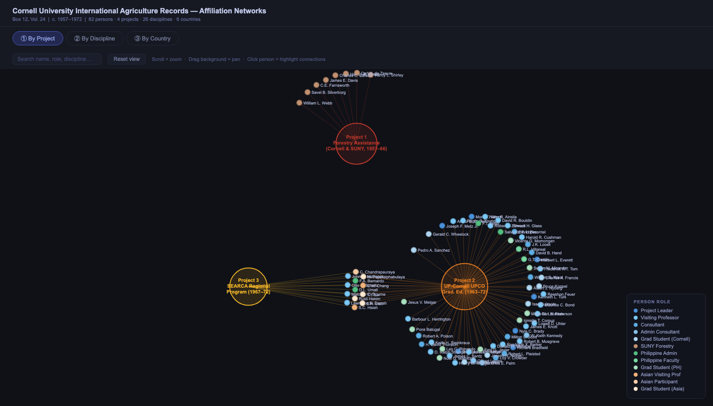
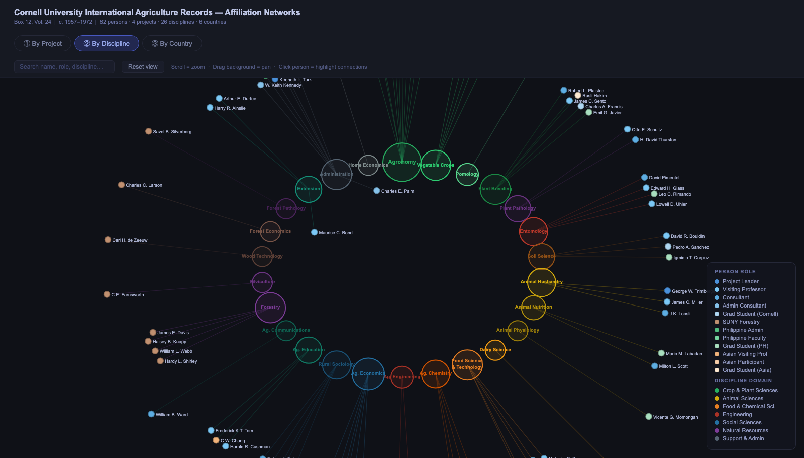
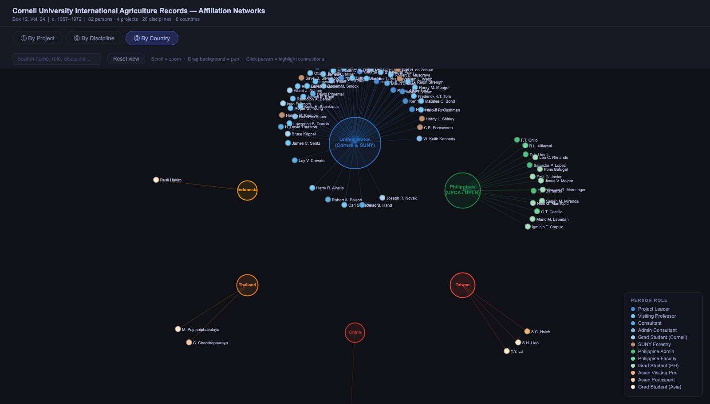

# Cornell University International Agriculture Records, Box 12 Volume 24

> Wiki-style research page derived from the Cornell University International Agriculture Records, Box 12, Vol. 24, Call No. 21-2-1700. Research conducted May 2026.

## Summary

Box 12 / Volume 24 of the Cornell University International Agriculture Records documents three linked agricultural development programs in the Philippines and Southeast Asia between 1957 and 1972. The records cover final reports, annual reviews, consultant trip reports, graduate student papers, planning documents, budgets, appendices, and correspondence.

The programs centered on Cornell University's role in building agricultural education, research capacity, graduate training, and regional cooperation around the University of the Philippines at Los Banos. Across the archive, 82 named participants appear from 5 states and 26 academic disciplines.

## Basic Facts

| Field | Detail |
|---|---|
| Collection | Cornell University International Agriculture Records |
| Archive unit | Box 12, Volume 24 |
| Call number | 21-2-1700 |
| Date range | c. 1957-1972 |
| Holding institution | Cornell University Library Annex |
| Physical item | 3,254-page digitised PDF |
| Main location | Los Banos, Laguna, Philippines |
| Main partner institutions | Cornell University; University of the Philippines College of Agriculture; University of the Philippines College of Forestry; SEARCA |
| Named participants | 82 |
| States represented | 6 |
| Disciplines represented | 26 |

## Programs

| Code | Program | Dates | Contractor | Funder | Partner |
|---|---|---:|---|---|---|
| P1 | Forestry Assistance Program | 1957-1966 | Cornell University, then SUNY College of Forestry at Syracuse | USAID / ICA | University of the Philippines College of Forestry |
| P2 | UP-Cornell Graduate Education Program / UPCO | 1963-1972 | Cornell University | Ford Foundation, with additional support from USAID, Rockefeller Foundation, and World Bank infrastructure funding | University of the Philippines College of Agriculture |
| P3 | SEARCA Regional Program | 1967-1972 | Cornell University | Ford Foundation | UPLB / SEARCA |

## Project 1: Forestry Assistance Program

The Forestry Assistance Program began in 1957, the same year the University of the Philippines College of Forestry was formally separated from the Philippine Bureau of Forestry. The program addressed postwar rebuilding, faculty training, curriculum development, research capacity, facilities, and administration.

By June 1966, the College had 49 faculty members. Thirty-two had been sent abroad for further education or training, and 22 current faculty members had earned advanced degrees. The program also supported new physical facilities, including a sawmill, garage and maintenance shop, forest products teaching laboratory, and faculty housing.

### P1 Personnel

| Name | Role | Discipline |
|---|---|---|
| Hardy L. Shirley | SUNY project leader / dean | Forestry |
| James E. Davis | SUNY visiting professor | Forestry |
| William L. Webb | SUNY visiting professor | Forestry |
| C.E. Farnsworth | SUNY visiting professor | Silviculture |
| Halsey B. Knapp | SUNY visiting professor / project leader | Forestry |
| Carl H. de Zeeuw | SUNY visiting professor | Wood Technology |
| Charles C. Larson | SUNY visiting professor | Forest Economics |
| Savel B. Silverborg | SUNY visiting professor | Forest Pathology |

## Project 2: UP-Cornell Graduate Education Program / UPCO

The UP-Cornell Graduate Education Program, or UPCO, was the largest and most sustained program in the archive. It ran from 1963 to 1972 and aimed to transform the University of the Philippines College of Agriculture from a teaching college into a research-intensive graduate institution with regional reach.

UPCO supported graduate fellowships, visiting professors, short-term consultants, research programs, curriculum modernization, laboratory construction, library development, computing infrastructure, and the Association of Colleges of Agriculture in the Philippines.

### Project Leaders

| Name | Discipline | Period |
|---|---|---|
| Nyle C. Brady | Agronomy | Sep 1963-Nov 1963 |
| Richard Bradfield | Agronomy | Jan 1964-Jul 1964 |
| Herbert L. Everett | Agronomy | Jul 1964-Jan 1966 |
| George W. Trimberger | Animal Husbandry | Jan 1966-Nov 1967 |
| Joseph F. Metz Jr. | Agronomy | Sep 1967-Jul 1969 |
| Kenneth L. Turk | Administration | Acting / overlap |
| Morrill T. Vittum | Vegetable Crops | Jun 1969-Jun 1972 |

### Major Components

| Component | Description |
|---|---|
| Graduate training | Fellowships for Philippine faculty to pursue M.S. and Ph.D. training at Cornell and other universities. |
| Visiting professors | Cornell faculty posted to Los Banos for one- to two-year teaching and research assignments. |
| Consultants | Short visits by Cornell specialists to advise departments and programs. |
| Asian participation | Visiting professors and graduate students from Taiwan/ROC, Thailand, and Indonesia. |
| Infrastructure | World Bank-supported building program and UPCO-funded facilities including the Los Banos Computing Center and Food Science pilot plant. |
| ACAP support | Research and graduate training support for member colleges in the Association of Colleges of Agriculture in the Philippines. |

## Project 3: SEARCA Regional Program

SEARCA, the Southeast Asian Regional Center for Graduate Study and Research in Agriculture, emerged from the regional ambitions of UPCO. Where P2 focused on building UPCA's graduate capacity, P3 formalized Los Banos as a regional agricultural education and research hub.

P3 overlapped with the later years of P2. Several Cornell visiting professors bridged both programs, including Malcolm C. Bourne, Otto E. Schultz, John N. Hathcock, and Lawrence B. Darrah. Asian participants from Taiwan/ROC, Thailand, and Indonesia also appear in the P2-P3 overlap.

### Asian Participants

| Name | Role | Discipline | Country |
|---|---|---|---|
| S.C. Hsieh | Asian visiting professor | Agricultural Economics | Taiwan |
| C.W. Chang | Asian visiting professor | Agricultural Education | Taiwan |
| C. Chandrapauraya | Asian participant | Food Science & Technology | Thailand |
| Rusli Hakim | Graduate student, Asia | Plant Breeding | Indonesia |
| Y.Y. Lu | Graduate student, Asia | Agricultural Economics | Taiwan |
| S.H. Liao | Graduate student, Asia | Agricultural Economics | Taiwan |
| M. Pajanaiphabulaya | Graduate student, Asia | Home Economics | Thailand |

## Affiliation Networks

Three bipartite affiliation networks were constructed from the personnel register. Each links people to one type of hub: project, discipline, or state. The interactive version is available in [Cornell_Affiliation_Networks.html](Cornell_Affiliation_Networks.html).

### Network by Project

| Project membership | Persons | Share |
|---|---:|---:|
| P1 only | 8 | 10% |
| P2 only | 56 | 68% |
| P3 only | 0 | 0% |
| P2 and P3 | 13 | 16% |
| Total unique persons | 82 | 100% |

Key point: P2 is the dominant program by personnel count. P3 is best read as a regional extension of the late UPCO phase rather than an entirely separate personnel system.

### Network by Discipline

| Discipline | Persons |
|---|---:|
| Agronomy | 11 |
| Agricultural Economics | 7 |
| Administration | 7 |
| Plant Breeding | 6 |
| Food Science & Technology | 5 |
| Agricultural Chemistry | 5 |
| Vegetable Crops | 5 |
| Entomology | 4 |
| Animal Husbandry | 4 |
| Rural Sociology | 4 |
| Forestry | 4 |

Key point: the archive is heavily anchored in crop science, agricultural economics, administration, food and chemical sciences, and plant breeding, while also including forestry, rural sociology, extension, engineering, and animal sciences.

### Network by State

| Country | P1 | P2 | P3 | Unique persons |
|---|---:|---:|---:|---:|
| USA | 8 | 52 | 4 | 53 |
| Philippines | 0 | 15 | 2 | 15 |
| Taiwan / ROC | 0 | 4 | 4 | 4 |
| Thailand | 0 | 2 | 2 | 2 |
| Indonesia | 0 | 1 | 1 | 1 |
| Total | 8 | 74 | 13 | 82 |

Column totals exceed 82 because 13 persons appear in both P2 and P3.

## Cross-Project Participants

The following people appear in both P2 and P3:

| Name | Discipline | Country |
|---|---|---|
| Malcolm C. Bourne | Food Science & Technology | USA |
| Otto E. Schultz | Plant Pathology | USA |
| John N. Hathcock | Agricultural Chemistry | USA |
| Lawrence B. Darrah | Agricultural Economics | USA |
| D.L. Umali | Administration | Philippines |
| F.A. Bernardo | Administration | Philippines |
| S.C. Hsieh | Agricultural Economics | Taiwan |
| C.W. Chang | Agricultural Education | Taiwan |
| C. Chandrapauraya | Food Science & Technology | Thailand |
| Rusli Hakim | Plant Breeding | Indonesia |
| Y.Y. Lu | Agricultural Economics | Taiwan |
| S.H. Liao | Agricultural Economics | Taiwan |
| M. Pajanaiphabulaya | Home Economics | Thailand |

## Thematic Topics

| Theme | Archive content |
|---|---|
| Graduate education and training | Fellowships, degrees, thesis supervision, graduate assistantships, completion records. |
| Curriculum development | Syllabi, course modernization, laboratory teaching, adaptation of US agricultural science curricula to Philippine tropical conditions. |
| Faculty development | Overseas training, recruitment, salaries, promotion, and retention of trained staff. |
| Physical facilities | Buildings, laboratories, equipment procurement, faculty housing, World Bank reporting. |
| Research programs | Crop science, animal science, food technology, soil science, agricultural economics, rural sociology, and related fields. |
| Extension and outreach | Farmer contact, vocational agriculture education, extension worker training, ACAP networks. |
| Institutional administration | Program management, budgets, counterpart funds, Ford Foundation reporting, inter-institutional coordination. |
| Regional cooperation | Asian participation, SEARCA formation, regional conferences, IRRI links, JCRR participation. |

## Key Institutions

| Institution | Country / scope | Role |
|---|---|---|
| Cornell University, New York State College of Agriculture | USA | Primary contractor for P2; initial contractor for P1. |
| SUNY College of Forestry at Syracuse | USA | Contractor for P1 from 1960 to 1966. |
| University of the Philippines College of Agriculture | Philippines | Main partner for P2 and P3. |
| University of the Philippines College of Forestry | Philippines | Main partner for P1. |
| Ford Foundation | International | Primary funder for P2 and P3. |
| USAID / AID / ICA | USA | Primary funder for P1 and co-funder for P2. |
| World Bank | International | Infrastructure funding for UPLB buildings. |
| Rockefeller Foundation | International | Fellowship and co-funding support for P2. |
| Sino-American Joint Commission on Rural Reconstruction | Taiwan / USA | Supported Asian participant routes into P2 and P3. |
| SEARCA | Southeast Asia | Regional center institutionalized through P3. |
| ACAP | Philippines | National network of agriculture colleges supported by UPCO. |
| IRRI | Philippines / international | Co-located Los Banos research institution and informal collaborator. |

## Files

| File | Description |
|---|---|
| [Cornell_Archive_Research_Summary.md](Cornell_Archive_Research_Summary.md) | Full research summary with detailed tables and Mermaid diagrams. |
| [Cornell_Affiliation_Networks.html](Cornell_Affiliation_Networks.html) | Interactive D3 network visualization. |
| [figures/cornell_network_project.png](figures/cornell_network_project.png) | Static project network graph. |
| [figures/cornell_network_discipline.png](figures/cornell_network_discipline.png) | Static discipline network graph. |
| [figures/cornell_network_country.png](figures/cornell_network_country.png) | Static state network graph. |
| Cornell_Archive_Summary.docx | Word archive overview. |
| Cornell_Projects_and_Personnel.docx | Word project and personnel report. |

## Notes

- The archive documents three contractually or institutionally distinct programs, although P2 and P3 overlap operationally.
- P3 is treated as a separate affiliation category because it had a distinct regional mandate and a partially distinct participant profile.
- The interactive network header may refer to "4 projects"; the formal project structure used here is three programs: P1, P2, and P3.

## Source

Cornell University International Agriculture Records, Box 12, Vol. 24, Call No. 21-2-1700. Research conducted by Kuan-Chi Wang, May 2026.
